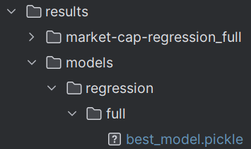
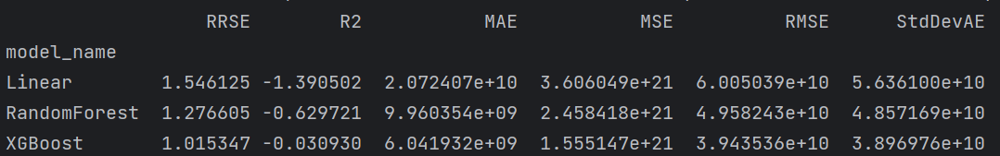
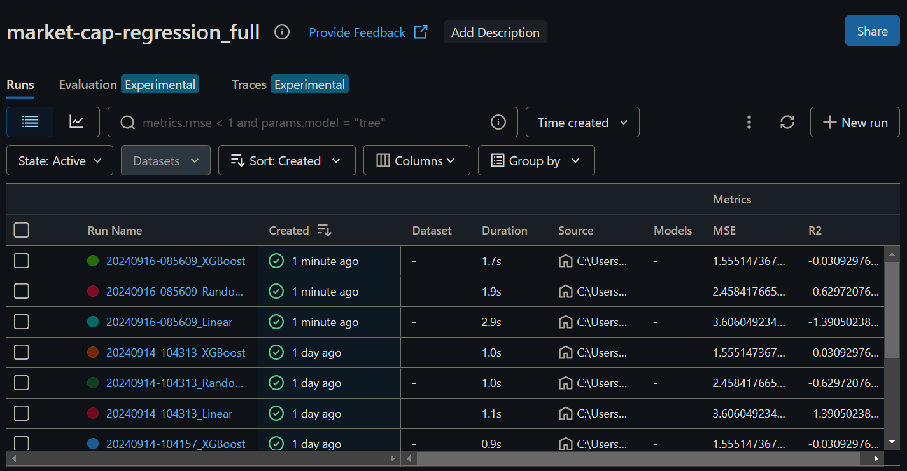

# crypto-virality-e2e-model

This repo allows you to extract features from crypto whitepapers and
use that data to predict the market cap of the associated crypto product.

### Description

The aim of this project was not to build an accurate prediction engine.
That's not possible without a very deep understanding of the crypto space,
a similar understanding of human nature, a genius intellect, huuuuge amounts
of compute and data, and more. I don't have any of these things. And even if
I did, this task is still very difficult.

The purpose of this project was to demonstrate how one could go about gathering
semi-structured raw data from the internet, organise this data, and use it
to train a variety of ML models in an abstracted, methodical way.

### Gathering Data

The first part of the project was collating a dataset.

I accessed crypto whitepapers through https://whitepaper.io/
and gathered market cap data from https://www.coingecko.com/.

Convoluted method of extracting features:

1. Use the CG API to extract market caps of top 100 coins
2. Scrape the remaining market caps of all other coins from CG web
3. Get whitepaper pdf page urls by scraping whitepaper.io
4. Use those to obtain the raw pdf urls
5. Feed those pdf urls into a PDF parser and extract pdf data

I then performed basic EDA and data prep to generate a 
dataset ready for modelling.

### Running Experiments

It was then time to create abstractions to allow me to
run experiments, following the method outline in 
the [beyond-jupyter repo](https://github.com/aai-institute/beyond-jupyter).

These abstractions allowed me to train multiple models
in multiple training batches. 

Saving the best model:

Output results of training batch:

As well as surface these results in MLFlow:

### Main Tools

- pycoingecko
- BeautifulSoup
- selenium
- PyPDF2
- scikit-learn
- XGBoost
- MLflow
- sensai
